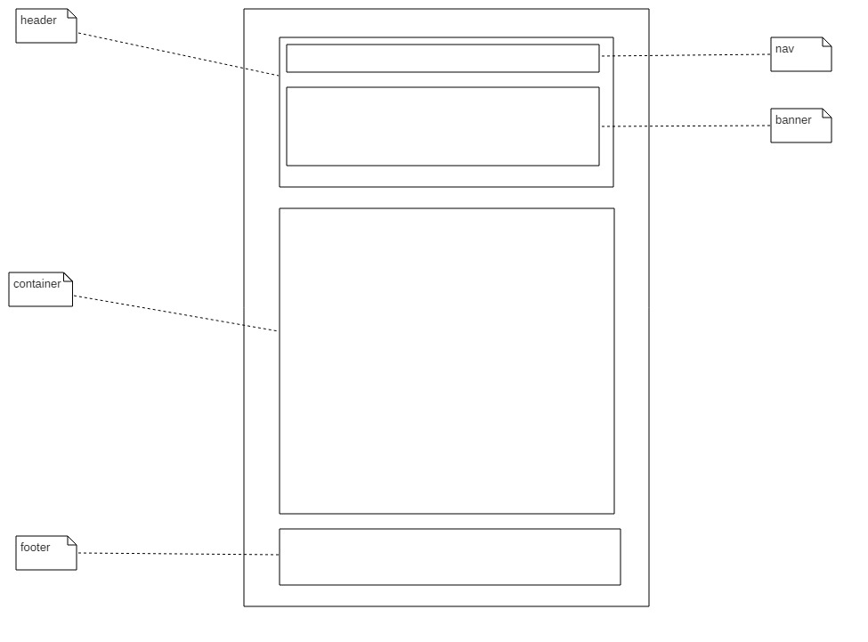

##　使用方法

    git clone https://github.com/503945930/Team.git
    cd code-s/
    npm i
    npm run start

然后打开浏览器访问 [http://localhost:3000](http://localhost:3000)

## 相关图片

## 页面结构

* [home](http://503945930.github.io/Team/html/index.html)
* [team](http://503945930.github.io/Team/html/team.html)
* [contactus](http://503945930.github.io/Team/html/contactus.html)
